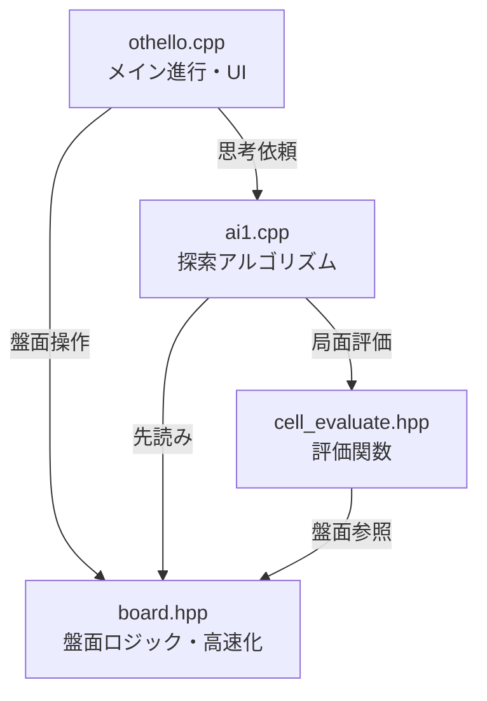

# Othello AI Logic

このディレクトリには、C++で実装されたオセロAIのコアロジックが含まれています。
GUIアプリケーションから呼び出されることを想定した、高速なビットボード/インデックスベースの処理系です。

## 📂 File Structure

### [othello.cpp](othello.cpp)
ゲームのメインプログラムです。
- ユーザーインターフェース（CUI）とゲームループを管理します。
- プレイヤー（人間）とAIの手番を制御し、勝敗を決定します。
- **主な関数**:
    - `main`: ゲームの進行管理。
    - `print`: コンソールへの盤面表示。
    - `init_game`: ゲームの初期化。

### [board.hpp](board.hpp)
オセロの盤面状態を管理するヘッダーファイルです。
- **特徴**: 高速化のため、盤面を特定のインデックス（3進数表現など）で管理し、事前計算されたテーブルを用いて合法手判定や石の反転を定数時間に近い処理で行います。
- **主な機能**:
    - `legal_place`: 合法手の判定。
    - `move`: 着手処理と石の反転。
    - `init_board`: 遷移テーブルの初期化。

### [ai1.cpp](ai1.cpp)
AIの思考ルーチン（探索部）です。
- **アルゴリズム**: **Nega-alpha法**（Minimax法の改良版、Alpha-Beta法と同等）を採用しています。
- 指定された深さまで先読みを行い、最善の手を返します。
- **主な関数**:
    - `search`: 探索のルート関数。
    - `nega_alpha`: 再帰的な探索関数。

### [cell_evaluate.hpp](cell_evaluate.hpp)
盤面の評価関数です。
- **手法**: **位置重み付け評価**（Static Evaluation）。
- 盤面の各マスに予め決められた点数（四隅は高く、その周辺は低くなど）を割り当て、現在の盤面のスコアを算出します。
- **主な機能**:
    - `evaluate`: 現在の盤面の評価値を計算。
    - `evaluate_init`: 評価テーブルの初期化。

## 🛠 Dependencies

- 標準C++ライブラリ (`<iostream>`, `<stdio.h>`, `<string>`)
- 各ファイルは相互に依存しています（`othello.cpp` が他をインクルード）。

## 🚀 Usage (Standalone)

単体でコンパイルして実行する場合：

```bash
g++ othello.cpp -o othello
./othello
```



### 🔄 実行の流れ（AIの手番）

1. **思考開始 (`othello.cpp`)**: 
   - AIの手番が来ると、`othello.cpp` が `search(b, 10)` を呼び出し、現在の盤面 `board b` を渡して「10手読み」を依頼します。

2. **探索 (`ai1.cpp`)**: 
   - `search` 関数から `nega_alpha` 関数（再帰探索）に入ります。
   - ネガアルファ法により、「自分は最善手（得する手）、相手も最善手（自分を損させる手）」を選び続けると仮定して、ゲーム木を展開します。

3. **盤面シミュレーション (`board.hpp`)**: 
   - AIが未来の盤面を予測する際、`b.move()` を頻繁に呼び出します。
   - `board.hpp` は、事前計算されたテーブル（遷移テーブル）を参照し、石を裏返す処理を高速に行います。ループ計算ではなく配列参照で処理するため、大量の探索が可能になります。

4. **評価 (`cell_evaluate.hpp`)**: 
   - 探索の深さが指定（10手）に達すると、`evaluate(b)` が呼ばれます。
   - 盤面の各マスに設定された重み（`cell_weight`）に基づき、「現局面の有利度」を数値化して返します（角は高得点、危険地帯は減点など）。

5. **決定 (`othello.cpp`)**: 
   - 全ての候補手を調べ終えると、最も評価値が高かった手が `main` 関数に返され、実際に石が置かれます。